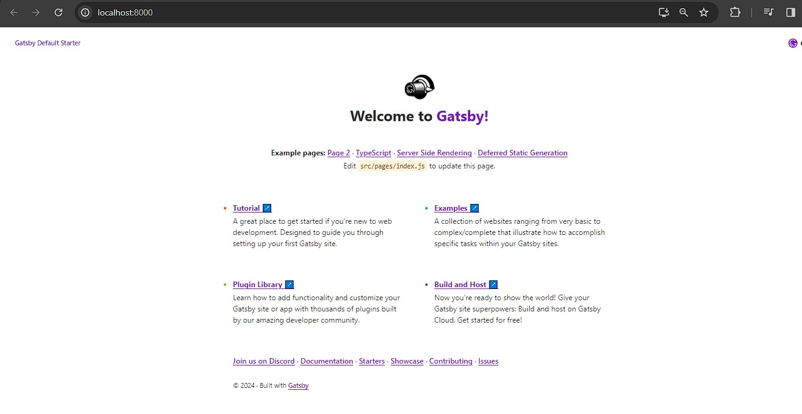
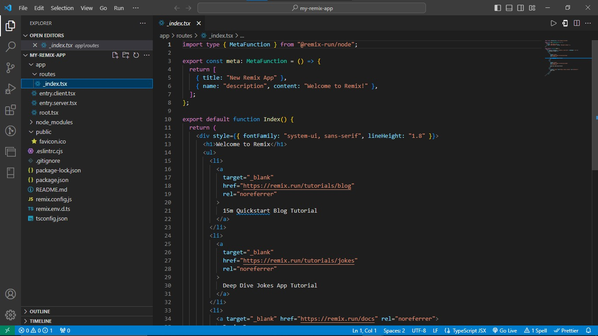
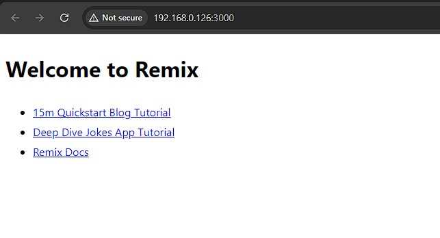
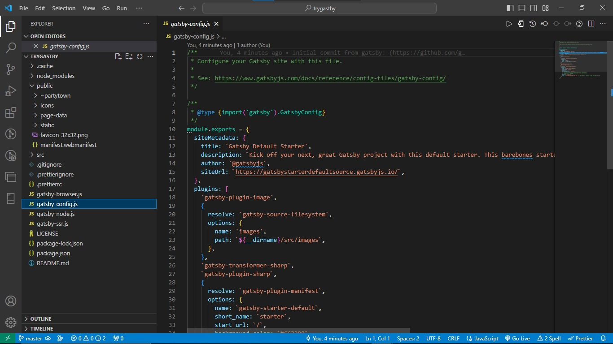
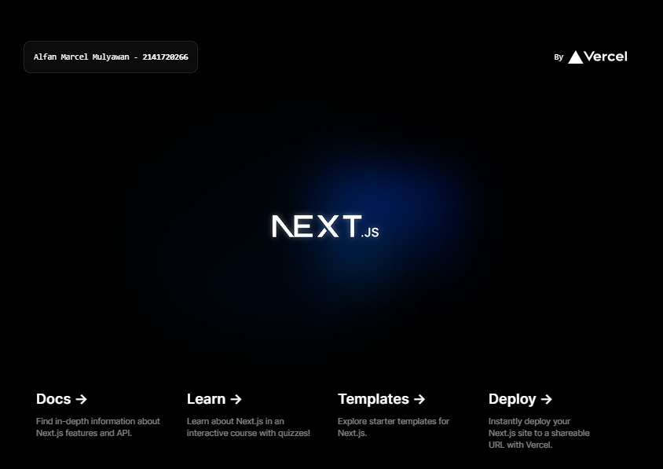
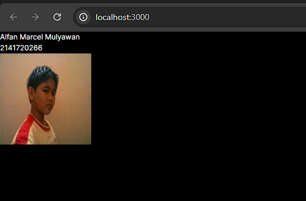

# Laporan Praktikum
|  | Pemrograman Berbasis Framework 2024 |
| ----------- | --------- |
| NIM | 2141720266 |
| Nama | Alfan Marcel Mulyawan |
| Kelas | TI-3A |

## Jawaban Soal 1
Pada gambar tersebut, silakan Anda browsing apa yang dimaksud dengan:

TypeScript : TypeScript adalah sebuah bahasa pemrograman yang merupakan superset (subset yang lebih luas) dari JavaScript. Dikembangkan oleh Microsoft, TypeScript dirancang untuk memperluas fungsionalitas JavaScript dengan menambahkan fitur-fitur tipe statis. Artinya, TypeScript memungkinkan pengembang untuk mendeklarasikan jenis data dari suatu variabel, parameter fungsi, properti objek, dan lainnya.

ESLint : ESLint adalah sebuah alat linting (pemeriksa kode) untuk JavaScript. Tujuan utamanya adalah untuk membantu pengembang menemukan dan memperbaiki pola kode yang tidak diinginkan atau potensi bug dalam kode JavaScript. ESLint memungkinkan pengguna untuk mengonfigurasi aturan linting sesuai dengan preferensi dan standar proyek mereka.

Tailwind CSS : Tailwind CSS adalah suatu framework CSS yang bersifat utility-first, yang dirancang untuk mempermudah pembuatan antarmuka pengguna (UI) dengan memberikan sejumlah besar kelas utilitas yang dapat diterapkan langsung pada elemen HTML. Berbeda dengan pendekatan tradisional menggunakan CSS yang memerlukan penulisan gaya stylesheet khusus untuk setiap elemen, Tailwind memanfaatkan kelas-kelas utilitas untuk mengatur tampilan dan perilaku elemen.

App Router : App Router adalah sistem routing yang disediakan oleh Next.js untuk mengelola navigasi antar halaman dalam aplikasi web Next.js Anda. Dengan menggunakan App Router, Anda dapat membuat aplikasi web yang dinamis dengan mudah, di mana setiap halaman dapat memiliki rutenya sendiri.

Import alias : Import alias (alias impor) adalah cara untuk memberikan nama singkat atau alternatif untuk impor suatu modul atau pustaka dalam kode JavaScript atau TypeScript. Ini memungkinkan pengembang memberikan nama yang lebih mudah atau lebih singkat saat mengacu pada modul atau pustaka tertentu, sehingga memudahkan pengelolaan kode dan meningkatkan keterbacaan.

### Perbedaan
React:

Deskripsi: React adalah perpustakaan JavaScript yang digunakan untuk membangun antarmuka pengguna (UI) dalam aplikasi web. Fokus Utama: React berfokus pada pembangunan komponen UI yang dapat di-render secara dinamis berdasarkan perubahan dalam data aplikasi. Keunggulan: Fleksibilitas dalam membangun UI, komunitas besar, dan dukungan dari Facebook.

Gatsby:

Deskripsi: Gatsby adalah kerangka kerja statis yang menggunakan React untuk membangun situs web yang sangat cepat dan efisien. Fokus Utama: Gatsby dirancang untuk menghasilkan situs web statis dengan performa tinggi dengan menggunakan pre-rendering dan teknologi pengoptimalan lainnya. Keunggulan: Kecepatan, SEO yang lebih baik, dan kemampuan untuk mengintegrasikan sumber data dari berbagai sumber.

Remix:

Deskripsi: Remix adalah kerangka kerja yang dibangun di atas React untuk memfasilitasi pengembangan aplikasi web dengan performa tinggi dan pengalaman pengembangan yang lebih baik. Fokus Utama: Remix mengutamakan performa tinggi, pengelolaan state yang lebih baik, dan pengalaman pengembangan yang ramah. Keunggulan: Dukungan routing yang kuat, manajemen state yang canggih, dan fokus pada performa dan pengalaman pengembangan yang baik.
## Jawaban Soal 2

### Folder:

.git: Folder ini berisi informasi tentang kontrol versi Git untuk proyek. Ini termasuk riwayat komit, cabang, dan tag.

.next: Folder ini digunakan oleh Next.js untuk menyimpan file build aplikasi.

assets: Folder ini berisi aset statis untuk aplikasi, seperti gambar, font, dan CSS.

node_modules: Folder ini berisi dependensi Node.js untuk aplikasi.

public: Folder ini berisi file statis yang akan disajikan langsung ke pengguna.

src: Folder ini berisi kode sumber untuk aplikasi.

### File:

.eslintrc.json: File ini berisi konfigurasi untuk ESLint, alat linting statis untuk JavaScript.

.gitignore: File ini berisi daftar file yang tidak ingin dilacak oleh Git.

next.config.mjs: File ini berisi konfigurasi untuk Next.js.

next-env.d.ts: File ini berisi deklarasi tipe untuk variabel lingkungan Next.js.

package.json: File ini berisi informasi tentang paket npm, termasuk nama, versi, dependensi, dan skrip.

package-lock.json: File ini berisi daftar dependensi npm yang diinstal untuk proyek, beserta versi spesifiknya.

postcss.config.js: File ini berisi konfigurasi untuk PostCSS, alat pemrosesan CSS.

README.md: File ini berisi informasi tentang proyek, seperti README.

tailwind.config.ts: File ini berisi konfigurasi untuk Tailwind CSS, framework CSS.

tsconfig.json: File ini berisi konfigurasi untuk TypeScript.
## Jawaban Soal 3

## Jawaban Soal 4
Terdapat perubahan, karena saya mengisikan sebuah text berupa nama dan nim saya pada komponen MyTextNimName(), maka akan muncul nama dan nim saya apabila komponen MyTextNimName() dipanggil.
## Jawaban Soal 5
Tidak ada perubahan tampilan, karena memanggil komponen Mypage() yang secara keseluruhan isinya sama persis dengan Home().
## Jawaban Soal 6

